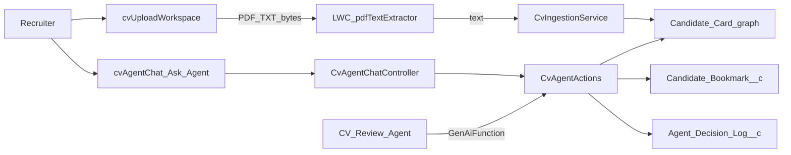

# CV Review Agent

Recruiter-facing Salesforce app for Ace Clouding: upload CVs, build structured **Candidate Cards**, then ask grounded questions / compare / score / bookmark without inventing facts that aren’t on the card.

Built and demoed on Agentforce DE org alias `cv-agent-de`  
(`yousseffj78.b0ec86663f9c@agentforce.com`).

---

## Architecture overview

Two ways in for the recruiter:

1. **CV Workspace** (`cvUploadWorkspace`) — multi-file upload, client-side PDF/TXT text pull, Apex parse into Candidate Cards.
2. **Ask Agent** (`cvAgentChat`) — in-app chat. Utterances go to `CvAgentChatController`, which routes into the same invocable ops as Agentforce (`CvAgentActions`).

Agentforce itself is wired as topic `CV_Review_Topic` → action `CV_Review_Agent_Action` → Apex `CvAgentActions`. Same grounding rules either way.



Scoring weights (fixed in `CvScoringService`): **Skills 40% / Experience 30% / Education 15% / Completeness 15%**.

---

## Data model and Candidate Card design

A “Candidate Card” is not one object — it’s a parent `Candidate__c` plus related rows. That kept Agentforce/Apex answers tied to queryable fields instead of free-form blobs.

| Object | What it holds |
|--------|----------------|
| `Candidate__c` | Name, contact, summary, years, parse status, uncertainty blurb, raw CV text, source file |
| `Candidate_Skill__c` | Skill name, confidence (`Extracted` / `Inferred` / `Missing`), evidence snippet |
| `Candidate_Experience__c` | Title, company, date text, description, date-conflict flag |
| `Candidate_Education__c` | School, degree, field, end date text |
| `Candidate_Data_Issue__c` | `Missing` / `Uncertain` / `Conflicting` + severity + field path |
| `Candidate_Bookmark__c` | Saved recommendation: overview, score, reasoning, role, recruiter notes |
| `Agent_Decision_Log__c` | Input/output JSON + score breakdown for audits |

**Design intent:** if something is fuzzy (overlapping jobs, missing email, inferred skill), it lands on `Candidate_Data_Issue__c` and/or a confidence enum — not only in the chat reply. Scores and interview gaps can then point at the same rows.

---

## Agent operations (`CvAgentActions`)

One invocable class, `operation` string selects the path:

| Operation | Does |
|-----------|------|
| `listCandidates` | Inventory of cards |
| `getCandidateCard` | Structured card dump |
| `listDataIssues` | Ambiguity / quality issues for a candidate |
| `searchCandidateFacts` | Grounded fact lookup; says “not found” instead of guessing |
| `scoreForRole` | Weighted score + strengths / concerns / trade-offs / gaps |
| `compareCandidates` | Rank 2+ cards for a role (Ask Agent also uses this for “top N”) |
| `bookmarkCandidate` | Write bookmark (+ auto-score if needed) |

Ask Agent (`CvAgentChatController`) maps plain English onto those ops (compare named people, top-N shortlist, card/skills questions, etc.) and expands the payload into a readable chat reply.

---

## Setup / deploy

```bash
sf org login web --alias cv-agent-de --instance-url https://login.salesforce.com
sf config set target-org cv-agent-de
sf project deploy start --source-dir force-app --target-org cv-agent-de
sf org assign permset --name CV_Recruiter --target-org cv-agent-de
sf apex run --file scripts/apex/seedSampleCandidates.apex --target-org cv-agent-de
```

App Launcher → **CV Review Agent** → **CV Workspace** (upload) or **Ask Agent** (chat).

### Agentforce bot (optional for UI preview)

Already on the DE org as `CV_Review_Agent`. Recreate/activate if needed:

```bash
sf agent create --name "CV Review Agent" --api-name CV_Review_Agent --spec specs/cvReviewAgentSpec.yaml --target-org cv-agent-de
sf agent activate --api-name CV_Review_Agent --version 1 --target-org cv-agent-de
sf org open agent --api-name CV_Review_Agent --target-org cv-agent-de
```

Notes from this orgfarm DE:

- `sf agent publish` on the authoring bundle sometimes 500s / fetch-fails — `sf agent create` + activate was the reliable path.
- Bot user needs Candidate object access (`CV_Recruiter` + the generated agent perm set). Stick the topic to `CV_Review_Agent_Action` only (no Knowledge action).

Smoke the Apex path the agent calls:

```bash
sf apex run --file scripts/apex/smokeAgentActions.apex --target-org cv-agent-de
```

Walkthrough prompts: [docs/DEMO.md](docs/DEMO.md).

---

## Key design decisions and trade-offs

1. **PDF text in the LWC, not Apex OCR**  
   Assignment allowed embedded PDF text (not OCR). PDF.js workers hang under Lightning Locker, so extraction is a lighter CID/ToUnicode pass in `pdfTextExtractor.js`. Trade-off: image-only scans still won’t work.

2. **Ambiguity as first-class data**  
   Issues live on `Candidate_Data_Issue__c` with severity. Chat and scoring consume that instead of soft “maybe” wording only in the LLM layer.

3. **One invocable router**  
   Apex only allows one `@InvocableMethod` per class. Operation enum keeps Agentforce’s action surface to a single GenAiFunction.

4. **Explainable scores over a single magic number**  
   Rubric breakdown + strengths/concerns/trade-offs/interview gaps, logged on `Agent_Decision_Log__c`. “Best available” is explicit when nothing clears the strong-match bar.

5. **Ask Agent as Apex chat, not only Agentforce UI**  
   In-tab ACC / util-bar packaging was painful on this DE, so recruiters get a first-class **Ask Agent** tab that calls the same Apex. Native Agent Builder preview still works if you want it.

6. **Private OWD + `CV_Recruiter` perm set**  
   Simple for a DE demo; not a full sharing redesign.

---

## Assumptions

- Demo CVs are text-based PDFs or TXT (seed script + sample fixtures cover the happy path).
- Role context (title, required skills, min years) comes from the recruiter utterance / defaults in the chat router when not spelled out.
- Agentforce features are already enabled on the target DE; metadata alone doesn’t turn the product on everywhere.
- Duplicate people (e.g. several “Youssef Mohamed” cards from re-uploads) are collapsed by first name when ranking/comparing from chat.

---

## Known limitations

- No OCR — scanned/image PDFs fall through to uncertain/stub handling.
- DOC/DOCX aren’t really parsed; use TXT/PDF text or the seed fixtures.
- Long fields get truncated to Salesforce limits; big files are processed one at a time (heap).
- Chat routing is keyword/heuristic (not a full NLU model). Odd phrasing can still miss the intended operation.
- Authoring-bundle publish is flaky on some orgfarm DEs; bot create/activate is the workaround documented above.
- No external LLM Named Credential — grounding is Candidate Card data via Apex.

---

## Testing approach

**Apex**

- `CvIngestionServiceTest` — TXT structure, conflicts, binary/empty paths
- `CvAgentActionsTest` — list / card / search / score / compare / bookmark + decision logs
- `CvAgentChatControllerTest` — utterance routing, full answer formatting, name dedupe, top-N rank

```bash
sf apex run test --tests CvIngestionServiceTest --tests CvAgentActionsTest --tests CvAgentChatControllerTest --target-org cv-agent-de --wait 20
```

**Manual** — follow [docs/DEMO.md](docs/DEMO.md): upload or seed, inspect cards, Ask Agent list/compare/top-N/bookmark, check Decision Logs.
